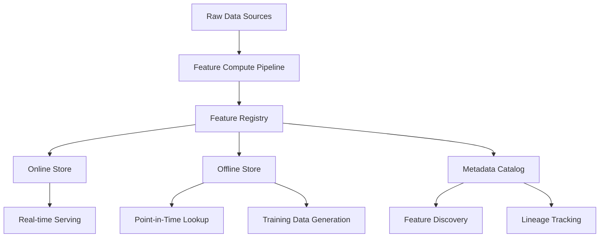
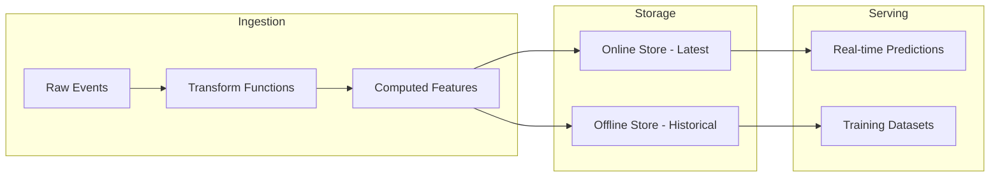
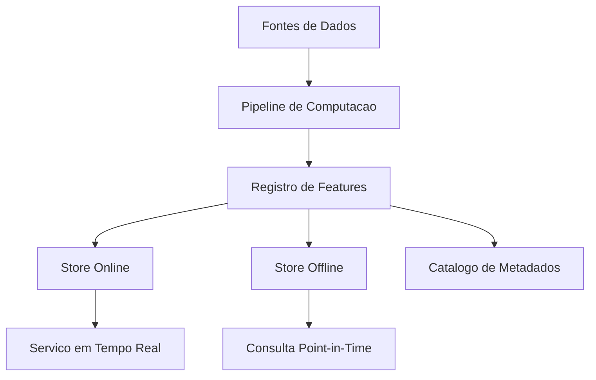

# Feature Store Engineering

<div align="center">


</div>

**[English](#english)** | **[Portugues (BR)](#portugues-br)**

---

## English

### Overview

A feature store implementation providing feature registry with versioning, online/offline stores, point-in-time lookups, feature computation pipelines, and a metadata catalog. Built in pure Python for ML feature management.

### Architecture



### Data Flow



### Features

- **Feature Registry**: Register, version, list, and filter feature definitions
- **Online Store**: Low-latency key-value store for latest feature values
- **Offline Store**: Historical feature storage with point-in-time lookups
- **Compute Pipeline**: Chain transform functions to derive features from raw data
- **Metadata Catalog**: Searchable catalog with feature descriptions and lineage

### Running Tests

```bash
pytest tests/ -v
```

### Author

**Gabriel Demetrios Lafis** - [GitHub](https://github.com/galafis)

---

## Portugues BR

### Visao Geral

Uma implementacao de feature store fornecendo registro de features com versionamento, stores online/offline, consultas point-in-time, pipelines de computacao de features e catalogo de metadados. Construido em Python puro para gerenciamento de features de ML.

### Arquitetura



### Funcionalidades

- **Registro de Features**: Registrar, versionar e filtrar definicoes
- **Store Online**: Armazenamento chave-valor para valores mais recentes
- **Store Offline**: Armazenamento historico com consultas point-in-time
- **Pipeline de Computacao**: Encadear funcoes de transformacao
- **Catalogo de Metadados**: Catalogo pesquisavel com descricoes e linhagem

---

## License

MIT License - see [LICENSE](LICENSE) for details.
