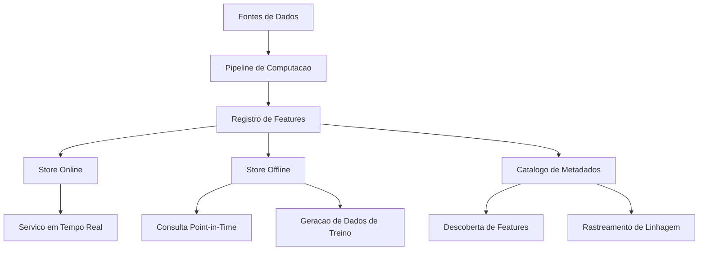
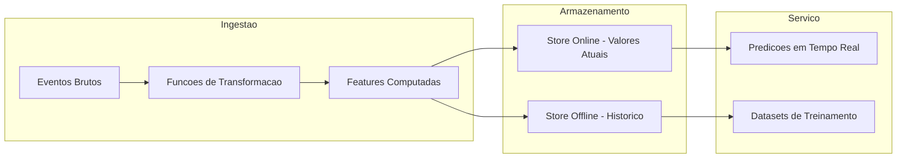
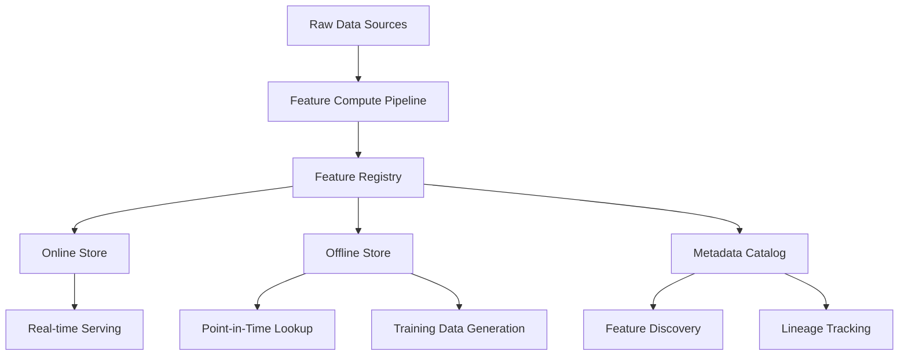

<div align="center">

# Feature Store Engineering


Implementacao de Feature Store em Python puro com registro de features, versionamento, stores online/offline e catalogo de metadados

[Portugues](#portugues) | [English](#english)

</div>

---

<a name="portugues"></a>

## Sobre

Este projeto implementa um **Feature Store** completo construido em Python puro, projetado para demonstrar os conceitos fundamentais de gerenciamento de features em pipelines de Machine Learning. O sistema oferece registro de features com versionamento automatico, armazenamento online para servico em tempo real, armazenamento offline para consultas historicas point-in-time, pipelines de computacao encadeados e um catalogo de metadados pesquisavel com rastreamento de linhagem. E um excelente recurso didatico para compreender como Feature Stores funcionam internamente.

## Tecnologias

| Categoria | Tecnologia |
|-----------|-----------|
| **Linguagem** | Python 3.11+ |
| **Dados** | Pandas, NumPy |
| **Visualizacao** | Matplotlib, Seaborn |
| **Testes** | pytest |
| **Containerizacao** | Docker |
| **Notebooks** | Jupyter |

## Arquitetura



### Fluxo de Dados



## Estrutura do Projeto

```
feature-store-engineering/
├── src/
│   ├── __init__.py
│   └── feature_store.py         # Modulo principal do Feature Store
├── feature_repo/                # Repositorio de definicoes de features
├── notebooks/                   # Notebooks de exploracao e exemplos
├── data/                        # Dados de exemplo
├── tests/                       # Suite de testes
├── docs/                        # Documentacao adicional
├── assets/                      # Recursos visuais
├── Dockerfile                   # Containerizacao
├── setup.py                     # Configuracao do pacote
├── pytest.ini                   # Configuracao de testes
├── requirements.txt             # Dependencias
├── LICENSE                      # Licenca MIT
└── README.md
```

## Funcionalidades

- **Registro de Features**: registrar, versionar, listar e filtrar definicoes de features com metadados completos
- **Store Online**: armazenamento chave-valor de baixa latencia para os valores mais recentes das features
- **Store Offline**: armazenamento historico com consultas point-in-time para geracao de datasets de treino
- **Pipeline de Computacao**: encadeamento de funcoes de transformacao para derivar features a partir de dados brutos
- **Catalogo de Metadados**: catalogo pesquisavel com descricoes, tags e rastreamento de linhagem

## Inicio Rapido

### Pre-requisitos

- Python 3.11+
- pip

### Instalacao

```bash
git clone https://github.com/galafis/feature-store-engineering.git
cd feature-store-engineering
pip install -r requirements.txt
```

### Uso

```python
from src.feature_store import FeatureDefinition, FeatureRegistry

# Registrar uma feature
feature = FeatureDefinition(
    name="temperatura_media",
    dtype="float",
    description="Temperatura media diaria em Celsius",
    entity="estacao_meteorologica",
    tags=["clima", "sensor"]
)

registry = FeatureRegistry()
registry.register(feature)
```

## Docker

```bash
docker build -t feature-store-engineering .
docker run -p 8000:8000 feature-store-engineering
```

## Testes

```bash
pytest tests/ -v
```

## Aprendizados

- Compreensao da arquitetura interna de um Feature Store e seus componentes fundamentais
- Implementacao de consultas point-in-time para evitar data leakage em datasets de treinamento
- Versionamento de definicoes de features para reproducibilidade de experimentos
- Separacao de stores online e offline para atender diferentes padroes de acesso
- Catalogo de metadados como ferramenta de descoberta e governanca de features

## Autor

**Gabriel Demetrios Lafis**

- GitHub: [@galafis](https://github.com/galafis)
- LinkedIn: [Gabriel Demetrios Lafis](https://www.linkedin.com/in/gabriel-demetrios-lafis/)

## Licenca

Este projeto esta licenciado sob a MIT License - veja o arquivo [LICENSE](LICENSE) para detalhes.

---

<a name="english"></a>

## About

This project implements a complete **Feature Store** built in pure Python, designed to demonstrate the fundamental concepts of feature management in Machine Learning pipelines. The system provides feature registration with automatic versioning, an online store for real-time serving, an offline store for historical point-in-time lookups, chained computation pipelines, and a searchable metadata catalog with lineage tracking. It serves as an excellent didactic resource for understanding how Feature Stores work internally.

## Technologies

| Category | Technology |
|----------|-----------|
| **Language** | Python 3.11+ |
| **Data** | Pandas, NumPy |
| **Visualization** | Matplotlib, Seaborn |
| **Testing** | pytest |
| **Containerization** | Docker |
| **Notebooks** | Jupyter |

## Architecture



## Features

- **Feature Registry**: register, version, list, and filter feature definitions with full metadata
- **Online Store**: low-latency key-value store for the latest feature values
- **Offline Store**: historical storage with point-in-time lookups for training dataset generation
- **Compute Pipeline**: chain transform functions to derive features from raw data
- **Metadata Catalog**: searchable catalog with descriptions, tags, and lineage tracking

## Quick Start

### Prerequisites

- Python 3.11+
- pip

### Installation

```bash
git clone https://github.com/galafis/feature-store-engineering.git
cd feature-store-engineering
pip install -r requirements.txt
```

## Docker

```bash
docker build -t feature-store-engineering .
docker run -p 8000:8000 feature-store-engineering
```

## Tests

```bash
pytest tests/ -v
```

## Learnings

- Understanding the internal architecture of a Feature Store and its core components
- Implementing point-in-time lookups to prevent data leakage in training datasets
- Feature definition versioning for experiment reproducibility
- Separating online and offline stores to serve different access patterns
- Metadata catalog as a tool for feature discovery and governance

## Author

**Gabriel Demetrios Lafis**

- GitHub: [@galafis](https://github.com/galafis)
- LinkedIn: [Gabriel Demetrios Lafis](https://www.linkedin.com/in/gabriel-demetrios-lafis/)

## License

This project is licensed under the MIT License - see the [LICENSE](LICENSE) file for details.
